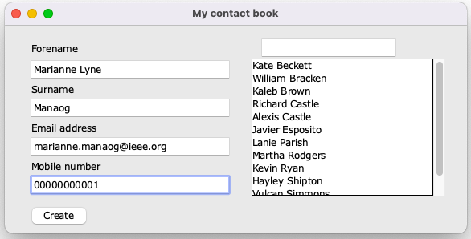
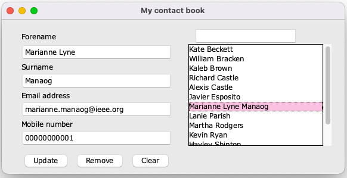
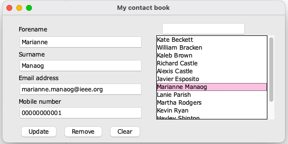
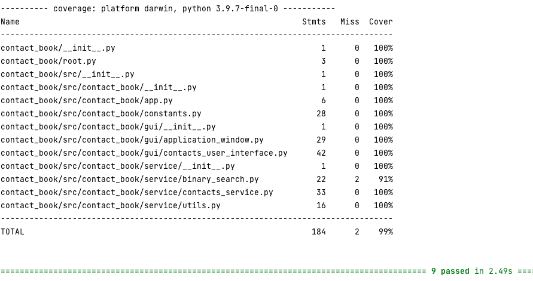

# README #

### What is this repository for? ###

This repository contains Python-based codes to run an application to create and maintain a contact book, including the first name, last name, email address, and phone number of own contacts.

### A note regarding Codio ###

This assignment was completed on the PyCharm IDE (2021.2.4) and local Anaconda environment, which, differently from Codio (and `pip3` within it), allowed to install the required Python libraries with up-to-date versions of the required Python libraries. Considering the incompatible environment on Codio, it was agreed with the tutor to provide evidence that the codes ran successfully here, e.g., test evidence/coverage report via pytest (under the section `'How do I run the tests?'` below), along with the instructions on how to set it up (`'How do I get set up?'` section below) and run it (`'How do I run the codes?'` section below).

### How do I get set up? ###

* Updating conda

Please update conda by running:

`conda update -n base -c defaults conda`

* Configuration of the environment

Please create a conda virtual environment and install all required dependencies of this application by
running: 

`conda env create --name contact_book --file environment.yml`

* Activating and deactivating the conda environment

To activate this environment, please run:

`conda activate contact_book`

To deactivate an active environment, please run the following command:

`conda deactivate`

* Data layer

To leverage the Python-based CRUD functions expected in this assignment, SQLite has not been used as the database of this application. Instead, the text file at `contact_book/src/contact_book/data/contacts_dict.txt` has been used.

### Description of the implementation ###

The CRUD operations are implemented in the `contacts_service.py` file under the `ContactsService` class, as follows:

- the `create_contact_logic` method allows to create a new contact via the Python function `append` to add the details of the new contact to each of the main fields (forename, surname, email address, mobile number) based on the users' inputs on the GUI, whilst their ID is auto-incremented (+ 1) with respect to the highest ID number amongst all contacts saved in the data; 

- the `choose_contact` method implements the 'read' functionality by reading contacts' data from a .txt file containing the data stored as a dictionary and converting them into a dataframe to identify the contact that the user selected and display their details on the GUI;
- the `update_contact_logic` method enables to update the above-mentioned four main contact's details by overwriting the corresponding relevant value in the dataframe of the contact to update;

- the `remove_contact_logic` method allows to delete a contact based on the user's selection on the GUI by leveraging the Python function `pop`.

The binary search algorithm in the `binary_search.py` enables to search for a contact based on their surname, further to sorting the contacts in alphabetical order.

### How do I run the codes? ###

To run the main CRUD operations from a GUI ('Create' button; 'Read' by clicking on the chosen contact; 'Update' button; 'Delete' by clicking on the 'Remove' button), please run the `app.py` file at `contact_book/src/contact_book` via
`python app.py` on a Python console. After that, a window will pop up, which will enable the user to perform any CRUD operations via buttons on the GUI.

To run the binary search algorithm to look for a surname in the list of contacts saved in the above-mentioned 
text file under the sub-section named 'Data layer', please run the `binary_search.py` file at 
`contact_book/src/contact_book/service` via `python binary_search.py` and input a surname to search when prompted.

### Testing strategy ###

Functional and regression tests were performed throughout the development; moreover, appropriate test data were generated in the folder `tests/contact_book/dummy_data`, including a dictionary of dummy contacts at `dummy_contacts_dict.txt`, a dictionary with a further dummy contact in it (`dummy_contacts_dict_prior_to_one_contact_removal.txt`), a dictionary with contacts prior to the removal of one of them (`dummy_contacts_dict_prior_to_one_contact_removal.txt`) and a dictionary with the contact to be removed during testing (`dummy_contacts_dict_wo_contact_removed.txt`). 

Both positive and negative test cases were covered where applicable, such as when testing whether a contact was found (at `test_binary_search.py`). Testing was automated via unit testing to identify any bugs proactively, and 99% coverage was achieved as evidenced below. 

### How do I run the tests? ###

You can run all tests by running `pytest tests`. To get the full coverage report as well, please run `pytest --cov=contact_book tests
`. 

You can view the total test coverage (99%) by expanding the section below.

#### Total test coverage ####

### Future work ###

Future work will involve:
- improving the binary search by adopting a faster approach for larger lists of contacts, e.g., 
interpolation search;
- integrating the chosen search algorithm into the tkinter-based GUI;
- adding validation for email addresses and mobile numbers.
